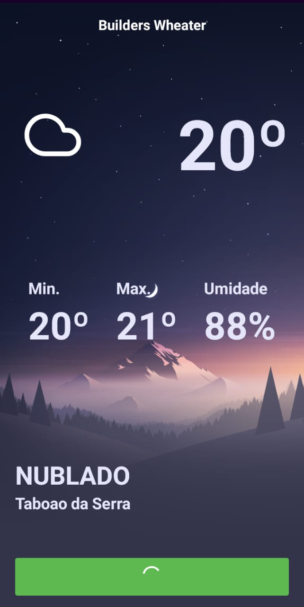
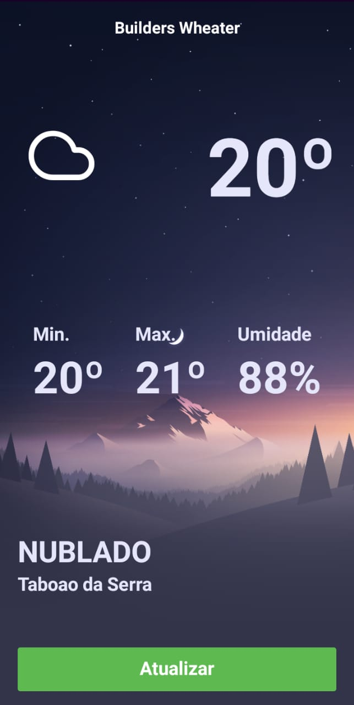

<h1 align="center">Welcome to Builders Wheater 👋</h1>
<p>
  
</p>

> Aplicação para exibir informaçoes climaticas baseado na localização do usuario

## Para rodar no emulador

```sh
  yarn start

  yarn react-native run-android
```

## View




## Author

👤 **Marcelo Silva**


## Show your support

Give a ⭐️ if this project helped you!

***
_This README was generated with ❤️ by [readme-md-generator](https://github.com/kefranabg/readme-md-generator)_
